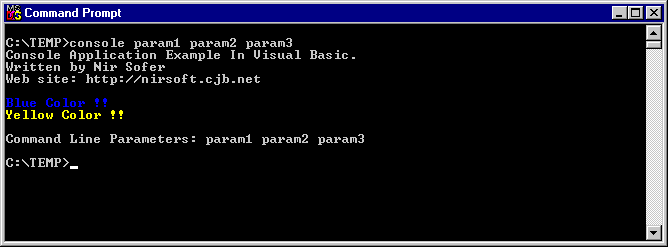
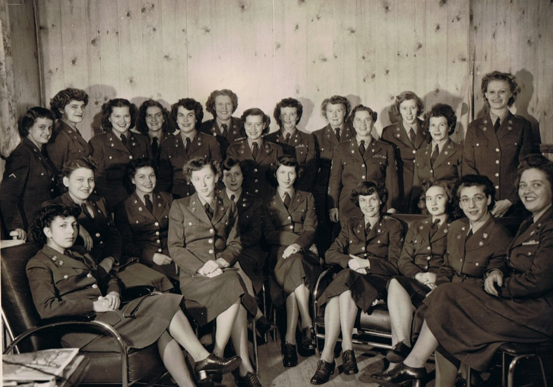
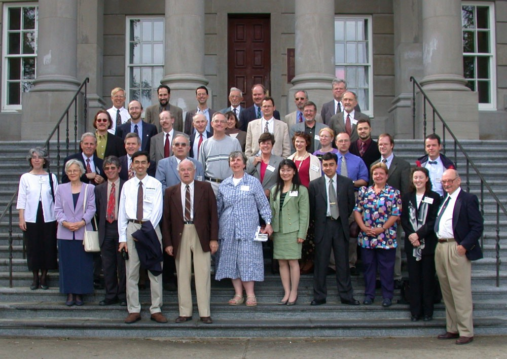
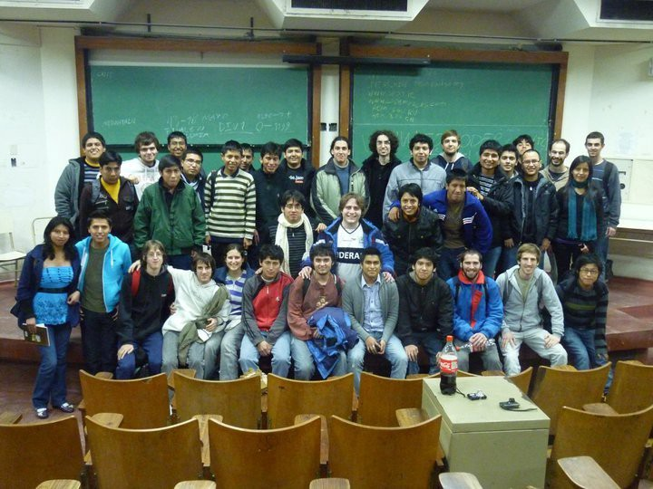

Imagina que un doctor entra a su consultorio y le dice a su asistente robot: Revisa estas 100 muestras de sangre y entrégame el informe de las personas que tienen cáncer. El robot las revisa y a los 5 minutos le indica al doctor que encontro 5 personas que se encuentran en una etapa temprana de cáncer y deben iniciar el tratamiento pronto.

Cuando era niña, esto era ciencia ficción. Solo en películas veía cómo los robots podían realizar diversas tareas, casi como los seres humanos lo harían. Era una idea muuuuy loca en ese entonces. Les hablo de una época en la que los celulares recién comenzaban a hacerse populares. Hace 15 años. Realmente no es mucho tiempo. Pero imaginar robots con inteligencia propia, inteligencia artificial, me resultaba muy emocionante pues sabía que algún día estos robots iban a existir.

Y no quería ver cómo eso sucedía sino que quería ser parte de ese cambio. ¡Yo quería crear estos robots con inteligencia artificial que puedan ayudar a la sociedad! Obviamente, no tenía la más mínima idea de cómo iba a hacer eso, pero sabía que era lo que quería hacer.

Para mi suerte, un día mi papá se acercó y me dijo: Hoy vas a aprender a programar. ¿Programar? ¿Qué es eso? Bueno, programar es hablar el lenguaje de las computadoras para que te entiendan y hagan lo que quieras, me explicó.

Me enseñó comandos super sencillos pero, ¡me divertí tanto! Aprendí a usar una pantalla negra como esta:

Aquí podía escribir y leer los mensajes que se ingresaban. Aprendí a usar condicionales: if/else. Mi programa preguntaba si te gustaba leer, por ejemplo. Si le respondías que sí, te preguntaba qué libros te gustaba leer. Si respondías que no, preguntaba otra cosa. Son instrucciones muy sencillas pero que se utilizan todo el tiempo.

No podía creer que yo podía decirle a una computadora qué hacer. O sea, todo el tiempo usaba la computadora para jugar, chatear, hacer mis tareas y demás. Usaba programas que ya existían y funcionaban de una forma definida. Pero que YO pueda crear uno de esos programas era: ¡Wow! ¡Tengo el poder!

Luego de esta experiencia y con las ganas de crear inteligencia artificial decidí estudiar Ingeniería de Software. Cuando se lo comentaba a mis amigos o familiares en me miraban como si estuviera loca. Incluso algunas personas me decían que elija otra carrera. No entendía por qué, pero yo quería estudiar ingeniería y seguí con esa idea.

Ingresé a la universidad y llegué al primer día de clases super emocionada. Entré a mi primera clase universitaria y lo primero que noté fue que en un salón de 20 personas solo eramos 3 chicas. Uhmm, ok… seguro en las siguientes clases seremos más chicas. Cinco años después, nunca vi más de 4 chicas en un salón. De pronto entendí las miradas raras que me dieron antes cuando mencionaba que iba a estudiar ingeniería. Al parecer, no es muy común que mujeres estudien ingeniería pero, felizmente, yo no lo sabía. De otro modo, es posible que hubiera cambiado de opinión.

Cuando ya estaba en el tercer año de estudios entré a un grupo donde practicábamos algoritmos avanzados para presentarnos en un concurso internacional. Y no. No habían 4 chicas en ese grupo. Ni siquiera 3 o 2. Esta vez yo era la única. Creo que hasta ese punto ya me había acostumbrado a esa realidad. Ya ni me parecía algo raro no ver chicas en un salón.

Terminé la universidad y ahora me tocaba trabajar. Una parte de mí esperaba que pueda encontrar más mujeres, pero no fue así. Ya estaba acostumbrada, de todos modos. Pero algo no se sentía bien. Todos estamos acostumbrados a no ver mujeres en estos campos pero no quiere decir que esté bien. De hecho, si nos preguntamos por qué tenemos tan pocas mujeres en el sector tecnológico encontraremos datos interesantes.

En primaria, el 74% de niñas están interesadas en ciencias, tecnología, ingeniería y matemática pero solo el 0.4% de ellas llegan a estudiar ciencias de la computación. ¿Qué pasa con todas esas otras niñas que alguna vez se interesaron en la ciencia? ¿Qué hizo que dejen de lado los intereses que tenían de más pequeñas?

Entre 1939 y 1945 se desarrolló la segunda guerra mundial. En esta época los hombres iban a la guerra y las mujeres se vieron obligadas a suplir muchos roles tradicionalmente masculinos en el mundo laboral. Y demostraron que podían ser igual de buenas o ¡incluso mejores!

*Mujeres que trabajaron como matemáticas y programadoras durante la Segunda Guerra Mundial*

*2001: Conferencia de la IEEE, una conferencia de ingeniería*

*2011: Curso de programación competitiva en Argentina*

Hace 50 años, en Estados Unidos, el 40% de egresados en ciencias de la computación eran mujeres. Hoy solo llegamos al 18%. El número de mujeres que participan en ciencias de la computación está disminuyendo con el paso del tiempo ¿Es que acaso nos dejamos llevar por estereotipos que nos dicen que las mujeres no pueden ser ingenieras?

Nos olvidamos de que mucho de lo que está siendo creado por hombres ingenieros tendrá un cliente que será una mujer. A menos que las mujeres estén involucradas en la implementación de estos productos, las empresas de tecnología se van a encontrar con muchas dificultades para desarrollar productos que respondan a las necesidades femeninas. ¡Las mujeres pueden y deben ser ingenieras!

En nuestro país, son pocos los colegios que enseñan a programar. Y, ¿cómo vamos a tener más mujeres programadoras si no conocen lo que es la programación? ¿Si no saben qué se puede lograr y qué magníficas oportunidades se pueden abrir con esta carrera? Fue así, que cuando conocí a Laura, una de mis pocas compañeras mujeres de trabajo, decidimos fundar WarmiLab.

Comenzamos a dar charlas y dictar talleres de programación gratuitos a niñas de secundaria de colegios públicos y privados de Lima. Nuestro primer taller tuvo 3 niñas. Sí, sólo 3. Debo admitir que nos sentimos un poco decepcionadas pues pensamos que quizás no llegaríamos a hacer el cambio que queríamos. Pero no nos rendimos. Poco a poco fuimos creciendo y ahora tenemos más grupos y más grandes.

De hecho, un grupo de ellas está creando una aplicación que se llama HandByHand. Esta aplicación te permite ubicar los centros de acopio y te indica la cantidad de artículos que se necesita donar ante un desastre. Ellas identificaron un problema: la falta de información centralizada ante desastres producidos por fenómenos naturales u otras emergencias. Plantearon una solución y comenzaron a implementarla. Tienen, en promedio, 15 años pero las ideas que tienen son geniales. Lo único que les damos son las herramientas para que puedan plasmar sus ideas en tecnología y puedan crear aplicaciones super útiles para la sociedad. El solo hecho de saber programar les abre la mente a más posibilidades y les hace ver que, no importa si eres niño o niña, puedes programar lo que tu imaginación te diga.

Ellas pueden hacerlo, tu puedes hacerlo. Thomas Suarez, un niño de Estados Unidos lo hizo desde los 12 años. Él quería desarrollar juegos para iPhone pero no tenía quién le enseñe. Así que dijo: Bueno, tendré que aprender por mi cuenta. Comenzó a buscar cursos por internet y desarrolló sus primeros juegos. Es más, ¡llegó a crear un club en su colegio! Hizo que más niños se unan y discutían qué aplicaciones podrían crear. Hoy tiene 17 años y ya tiene una empresa ¡Es un capo! ¡Y comenzó a los 12 años!

En Silicon Valley, las empresas, incluso las más famosas como Google y Facebook, están luchando para encontrar ingenieros de software a quiénes contratar. Pareciera no haber suficientes programadores ¡ni siquiera en la cuna de la tecnología! Esto está perjudicando la capacidad para hacer crecer empresas. Si las mujeres igualaran la cantidad de hombres que hoy son ingenieros, esto ayudaría a llenar este gran vacío de profesionales en tecnología.

Según el Departamento de Trabajo de Estados Unidos, cuando las niñas y niños que hoy tienen 12 años tengan edad de ir a la universidad, habrá un millón de posiciones laborales para ingenieros de software. Un millón. Pero no habrán suficientes profesionales que puedan contratar. Es decir, va a haber trabajo y ¡muy bien remunerado!

Pero no solo van a faltar profesionales, ¡van a faltar mujeres ingenieras! Teniendo una población mundial con un 50% de mujeres no debería existir tanta desigualdad en estos campos. Y más aún si esto puede significar un problema para la sociedad.

Hasta hace unos años, las mujeres sufrían altos efectos secundarios de medicamentos que se les recetaba. Durante generaciones, el modelo utilizado en la investigación y el diseño de medicamentos ha sido un varón. Incluso las ratas utilizadas en los experimentos de laboratorio eran masculinas. Simplemente no se consideró el sexo como una variable para las pruebas. Las mujeres somos fisiológicamente diferentes y tenemos la necesidad de administrar diferentes medicamentos y dosis. Hasta que las mujeres no se involucraron en la investigación científica y médica, los hombres no se dieron cuenta de la importancia de este factor.

Científicos e ingenieros trabajan para solucionar diversos problemas: Encontrar curas para enfermedades como el cáncer y la malaria, enfrentar el calentamiento global, suministrar agua potable a más personas o desarrollar energías renovables. Si sabes programar, puedes trabajar en estos y muchos más campos: Medicina, Música, Videojuegos, Geología, Moda, etc, etc, etc. No importa dónde estés o qué utilices, hay un software de por medio. Y si aún no existe, lo puedes crear ¿Se imaginan lo que es trabajar en algo que les apasione, que puedan ayudar a solucionar problemas y que encima te paguen por esto?

Yo comencé con la idea de hacer robots con inteligencia artificial. Me topé con personas que me decían que era una locura y que no podría hacerlo. Pero lo hice.

Hoy, la inteligencia artificial ya no es ciencia ficción sino ciencia. La ciencia y la tecnología funcionan gracias a la intuición y la creatividad. Eso es lo que nos permite ver más allá y nos permite crear cosas nuevas. Pero sobre todo, te permite cambiar el mundo. Solo necesitas tener las ganas de hacer algo diferente y estar dispuesto a experimentar. Lo que hoy suena a ciencia ficción, en 10 años o menos será una realidad.

¿Te imaginas que un doctor trabaje con un robot asistente que pueda escanear y tomar fotos de tu piel y que TAN SOLO analizando estas imágenes pueda determinar si tienes cáncer de piel? Ahora imagina que ese robot lo has creado tú.
