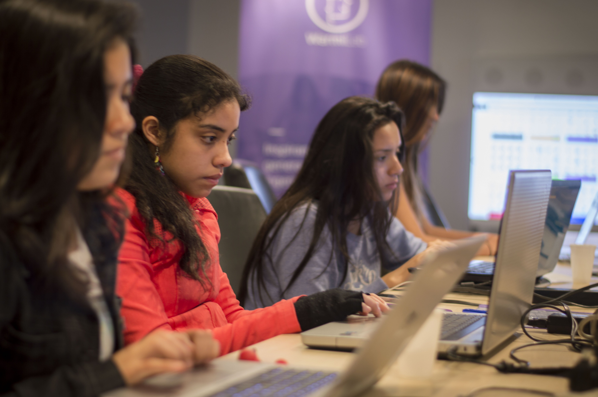

Un blog es una ventana al mundo. Aprovechémoslo para intentar cambiarlo y crear un mundo más inclusivo, con mayor participación de mujeres en ingeniería. Cuando escribes en un blog las personas te van a leer y te tomarán como referencia. Influenciar a otros es mucho más sencillo de lo que te piensas y podrás inspirar a la siguiente generación de ingenieras.

Además, escribir regularmente nos ayuda a mejorar las habilidades de comunicación, organización, estructurar ideas y pensamientos. Todo esto es muy importante puesto que son habilidades que las empresas buscan.

#### ¿Quieres escribir pero no sabes sobre qué?

Aquí tenemos algunas ideas con las que puedes comenzar:

* ¿Por qué decidiste estudiar ingeniería?
* ¿Cómo fue tu experiencia durante la universidad?
* ¿Cuál es el proyecto más emocionante en el que has participado?
* Lo que diría a mi YO de 16 años.
* ¿En qué proyecto estás trabajando ahora?
* ¿Por qué necesitamos más mujeres en ingeniería?
* ¿Con qué estereotipos has tenido para lidiar para convertirte en ingeniera?
* ¿Qué herramientas y contenido online puedo usar para aprender por mi cuenta?

### ¿Cómo agregar una entrada al blog?

Ser parte de nuestro equipo de escritores es muy sencillo. Puedes compartirnos un **Google Docs a info@warmiab.com** con tu artículo. Debe tener permiso de edición para que nuestros editores lo puedan revisar y publicar.

Si estás familiarizado con **github** y los archivos **markdown**, envíanos un **pull request** a [nuestro repositorio](https://github.com/warmilab/webapp/contenido/blog)

Crea una carpeta y un archivo index.md con metadata. Puedes revisar el formato en los artículos ya publicados. Luego de revisado y aprobado por nuestros editores, será publicado.

Recuerda agregar imágenes y links que complementen tu historia.

### Añade tu trabajo a LinkedIn

¿Ya eres escritora, revisas o editas en el blog de Warmilab? ¿Sabías que puedes agregar esta actividad en tu perfil de LinkedIn y resaltar el trabajo de voluntario que haces para nosotros? Cuando agregas tu experiencia de voluntario en LinkedIn, los reclutadores te ven como una persona completa y con buenas habilidades de comunicación.

Si aún no tienes una sección de trabajo voluntario en LinkedIn, [aquí tienes las instrucciones para poder agregarlo.](https://www.linkedin.com/help/linkedin/answer/1284?query=add%20volunteer%20work) Una vez que haz creado esta sección vas a requerir agregar una posición. Puedes seguir el siguiente ejemplo para completar tu experiencia como voluntario.

> Escribo para el blog de WarmiLab, una publicación online que tiene como objetivo inspirar a la siguiente generación de ingenierías y cambiar la percepción de las mujeres en ingeniería amplificando sus voces.
> Puedes ver mi trabajo en www.warmilab.com/blog

### ¿Quieres ser parte de nuestro grupo de editores?

Escríbenos a **info@warmilab.com** con asunto **Editores WarmiLab**. Cuéntanos tu experiencia como editor de contenidos y/o habilidades de comunicación y redacción.

Nos pondremos en contacto y te indicaremos los siguientes pasos para formar parte de nuestro equipo 🤗
