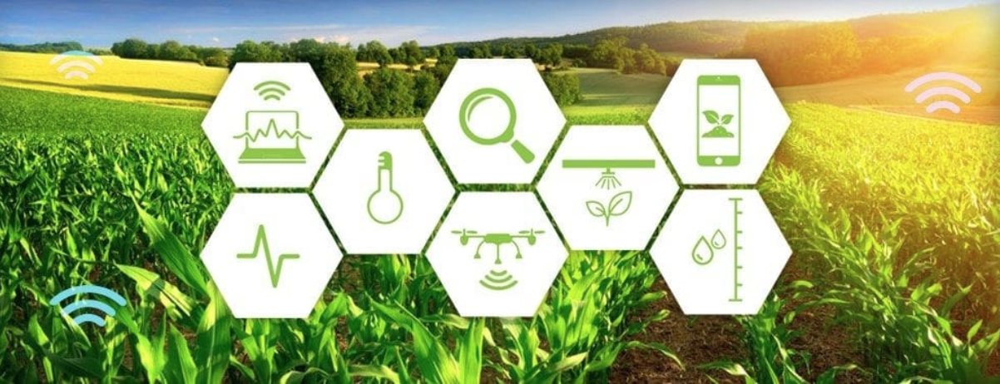
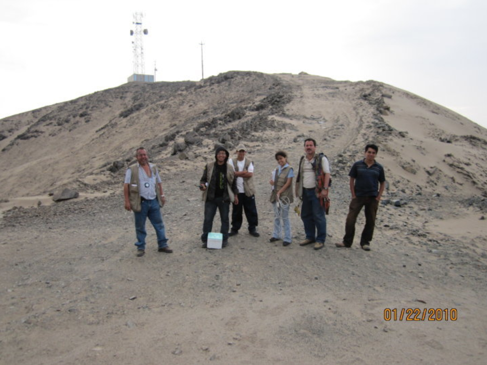

# Ingeniería de Telecomunicaciones

¿Se imaginan lo que hubiera sido vivir la crisis del Coronavirus y la cuarentena sin poder comunicarte con los que amas y se encuentran lejos? O sin poder acceder a información oportuna que te oriente sobre las medidas de prevención a tomar. Sin poder ver tus series favoritas o jugar en línea con tus amigos. Sin poder llevar las clases de tu último año en el cole. Ese sería un mundo sin telecomunicaciones. En los siguientes párrafos te voy a contar un poco de cómo hemos llegado a tener los sofisticados sistemas de Telecomunicaciones de los que disfrutamos actualmente y por qué estudiar Ing. de Telecomunicaciones(\*) es una opción interesante y gratificante como carrera.

Érase una vez hace más de 40 mil años, la humanidad llevada por su instinto de supervivencia realizó las primeras pinturas rupestres representando actividades como la caza, recolección o alguna otra actividad de su día a día, ésta fue una de las formas más incipientes de comunicación, un emisor, un mensaje, un medio y un receptor. En el Perú una de las más antiguas pinturas rupestres son las encontradas en las Cuevas de Sumbay en Arequipa.

 _Tropilla de camélidos en movimiento. En la parte superior, la imagen del suri o ñandú. Sumbay, Arequipa - 4000 a.c. Aprox_

Luego empezamos a necesitar llevar nuestros mensajes a otras áreas geográficas y comenzamos a tender puentes que nos conectarán con otros grupos.

Con el tiempo los desafíos se fueron haciendo cada vez más grandes, debíamos superar distancias más largas y poder entregar mensajes de manera masiva y en forma simultánea. Atendiendo esta necesidad es que la tecnología hizo su irrupción primero de manera mecánica con la imprenta alrededor de los 1400 D.C., luego dio el paso a sistemas de comunicación eléctrico - mecánicos con el telégrafo donde apenas podíamos enviar cortos mensajes de un par de oraciones, evolucionando luego a los electrónicos con conmutación mecánica donde ya teníamos la posibilidad de hacer escuchar nuestro voz del otro lado, hasta lo que vivimos ahora con la incorporación de la electrónica del transistor y la óptica que han hecho viable lo que conocemos ahora como “Internet” y la red móvil celular.

_Durante la primera mitad del siglo XX, un batallón de mujeres se encargaba de “conectar” a las personas a través de los conmutadores mecánicos_

Los "puentes" de nuestra época ya no son de madera y paja, de hecho en su mayoría ahora son “invisibles” y aunque la mayoría de la gente no lo sepa están extendidos literalmente por todos los medios mar, aire y tierra, aplicando conocimientos avanzados de la física de la naturaleza y de los materiales que hemos creado a partir de ella, hemos aprendido a llegar cada vez más lejos, más rápido y llevando más información.

Pero, ¿a qué viene todo esto? ¿No íbamos a hablar de ingeniería? Sí, y lo que te he contado tiene todo que ver, porque las ingenierías no son carreras abstractas si no una respuesta directa desde la Ciencia y la Tecnología a las necesidades de la sociedad. En el campo de las telecomunicaciones, la evolución ha sido exponencial y apenas cubre la demanda de los servicios que se desarrollan sobre ella.

Ahora sí luego de esta introducción vayamos a revisar con mayor detalle que hacen los Ing. de Telecomunicaciones.

Desde diseñar y operar los sistemas de comunicación con las naves o sondas espaciales que recorren el universo hasta construir redes de monitoreo de fauna silvestre para control y preservación de nuestros ecosistemas, esta carrera te brinda la oportunidad de desarrollar sistemas con diferentes aplicaciones de utilidad para la sociedad. Revisemos algunos ejemplos.

##### Operar y Optimizar la Internet

Muchos creen que es la ingeniería de sistemas es la que se encarga de construir y gestionar la “Internet”, pero esto no es totalmente cierto, de hecho son varias profesiones las que se requieren para hacer funcionar el internet entre las cuales tenemos: Ing. Eléctrica, Ing. Electrónica, Ing. Telecomunicaciones, Ing. de Sistemas, Ing. de Software, Ing. Civil entre otras.
La base sobre la que funciona la Internet no es otra cosa que una red de comunicaciones por tanto son los ingenieros de telecomunicaciones los que tienen la formación integral para desplegar y operar esta enorme “telaraña” que nos conecta a nivel mundial.
Así que si quieres dominar la “internet” ya sabes que estudiar.

[Ver Video](http://www.youtube.com/watch?v=iDbyYGrswtg)

##### TV, Radio

Sí, todas las antenas del Morro Solar que transmiten las señales de TV y de Radio AM/FM son instaladas y operadas por Ing. de Telecomunicaciones.

##### Comunicación móvil de voz y red de Internet de banda ancha

Esto te debe ser familiar, pero tal vez no conoces las dimensiones por darte un ejemplo: la información de un mensaje de Whatsapp puede pasar literalmente por cientos de equipos que van pasando la información de salto en salto. Lo mismo pasa con las llamadas de voz.

##### Telemedicina

¿Es posible realizar una atención médica o incluso una operación a distancia? Sí, y literalmente se pueden salvar vidas con ello, especialmente en el Perú donde los servicios médicos están concentrados en las ciudades, esta posibilidad puede hacer una gran diferencia.

##### Mejorar la productividad de diversos sectores:

Por ejemplo en agricultura, desarrollar sistemas y redes que ayuden a racionalizar el uso de agua y fertilizantes. En Pesca, sistemas que detecten la presencia de banco de peces, identifiquen si son del tamaño permitido, asegurando de esa manera una pesca sostenible y eficiente.

Y en la Industria en general, puedes desarrollar sistemas que ayuden a optimizar la producción monitoreando y ajustando las funciones que sean necesarias.

Desarrollar equipamiento: sí, puedes trabajar desde diseño de celulares de última generación hasta estaciones satelitales que capturen los mensajes que nos envía el universo. Los sistemas GPS que sirven para ubicarnos, ¡Sí! esos también son nuestros.

Manejar la información: darle un formato adecuado, encriptarla, transmitirla de modo seguro y desencriptarla del otro lado. Asegurar la integridad de la información transmitida es otro campo muy importante en desarrollo.

Reducir la burocracia: Puedes ser parte del diseño de sistemas que digitalicen procesos para hacerlos más accesibles, simples y rápidos, ayudando así a los ciudadanos a evitar trámites tortuosos. Temas como Ciudadanía digital y Smart Cities tienen Ing. De Telecomunicaciones trabajando en su desarrollo.

¿Fantástico no?

Cómo ves esta carrera te da la oportunidad de aplicar tus conocimientos impactando sectores muy diversos, y las aplicaciones pueden ser tantas como lo permita tu imaginación. Pero, recuerda que lo más importante es que puedes descubrir lo fantástico que es tener algo que ver en que más gente pueda comunicarse y encontrar lo que busca.

Finalmente los dejo con algunas _Preguntas Frecuentes_ que creo pueden tener:

##### ¿Qué habilidades se debe tener para estudiar esta carrera?

En principio no hay nada que no podamos aprender, pero se te hará más fácil estudiar esta carrera si tienes:
Curiosidad, esto es común a cualquier ingeniería.
Capacidad Analítica
Interés por el funcionamiento de las leyes del universo (Física)
Y sí, necesitarás muchas matemáticas, pero tranquilas que no es nada del otro mundo. Conozco gente que no era muy buena en matemáticas en el cole pero lograron hacer su carrera de ingeniería motivados por su pasión.

##### ¿Podré arreglar celulares?

Por supuesto, podemos arreglar celulares, pero normalmente no lo hacemos porque estamos reservando energía para cosas más importantes.

##### ¿Podré montar mi propia radio?

Claro, a mitad de carrera ya tienes todo el conocimiento necesario para ello.

##### ¿Podre hackear el WIFI a mi vecino?

Eso lo puedes hacer incluso sin estudiar ingeniería.

##### ¿Encontraré trabajo?

Sí, puedes trabajar en el sector público y privado, o poner tu propia empresa. Dedicarte a la investigación pura para optimizar todo lo que se ha desarrollado hasta ahora o crear nuevos medios/modelos de telecomunicación. El mercado laboral es bastante amplio y la ventaja que tienes es que se trata de una carrera de alcance global, es decir, la mayor parte del conocimiento que recibes aplica lo mismo que acá en la China, así que si tienes aspiraciones de trabajar en algún momento fuera del país esta carrera te da muchas oportunidades.

##### ¿Es una carrera para chicas?

Por supuesto, como cualquier otra carrera, todas las funciones que ejecutamos son perfectamente realizables por mujeres, algunas de ellas demandan un mejor estado físico por la dificultad de acceso a algunas zonas o el trabajo en altura (torres de telecomunicación), pero nada que nuestra voluntad no pueda vencer.

_Subiendo a pie un cerro cubierto de arena con el objetivo de mejorar los servicios de telecomunicaciones en Chimbote_

Es importante que sepas que en la actualidad representamos alrededor del 10 al 15% de estudiantes de la carrera -los números pueden variar ligeramente de acuerdo a la universidad o el país- eso conlleva a que la mayor parte del tiempo puedas encontrarte siendo la única chica en una reunión o proyecto, pero eso puede ir cambiando progresivamente si ahora tú decides estudiar la carrera. Uds. Puedes ser de la generación que cambie las estadísticas, porque el mundo nos necesita creando y accionando en ciencia y tecnología.

(\*) En algunos países vas a encontrar la carrera como una especialización de la carrera base que es la Ing. Eléctrica.
