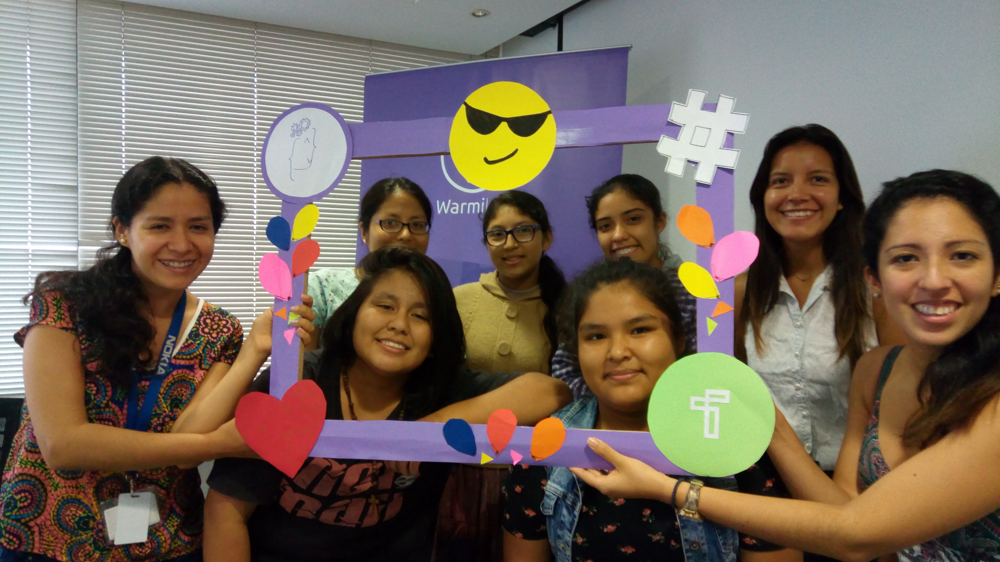

Les contamos que este año el SummerCamp de Warmilab ha empezado con un nuevo reto!!!!!!! Hemos convocado chicas que quisieron ser parte de algo diferente :D Dos grupos de nuestras chicas más afanadas están creando su app (desde cero!!) para el Technovation Challenge.

### ¿Qué es Technovation Challenge?

Es una competencia a nivel mundial en la que niñas presentan una app con el motivo de resolver un problema en su comunidad respecto a 6 temas: Pobreza, Paz, Igualdad, Educación, Medio Ambiente y Salud. Estos temas están inspirados en los Objetivos de Desarrollo Sostenible de las Naciones Unidas. Suena importante no? : )
El año pasado, 2016, incluso se lanzó una película con los equipos que llegaron a la final!!!! Por si desean verla se llama “CodeGirls” y está, por supuesto, en Netflix. Cuenta la historia de estas apps tan creativas desarrolladas por niñas de secundaria de diferentes partes del mundo!

Este año, con el apoyo de Warmilab y sus carismáticos voluntarios, dos equipos, uno Senior y uno Junior conformados por 4 y 3 niñas, respectivamente, están aprendiendo a crear una app, lanzarla, elaborar incluso un plan de negocio y presentarla (hacer un pitch). El concurso consta de 3 fases, la primera es una fase a nivel nacional. La segunda a nivel regional y de pasar esta ronda, las niñas tendrían la oportunidad de participar por un viaje a San Francisco, Estados Unidos, y hacer una presentación final frente a jurados y compitiendo con equipos de todo el mundo en Agosto!!!!!

### ¿De qué se tratan las apps?

El grupo Senior, WarmiChaska, conformado por: Gianella Belleza, Milagros Acero, Allie Merino y Nissei Collantes, está desarrollando la app llamada “Hand by Hand” y busca conectar a personas interesadas en ayudar en casos de desastres naturales con eventos organizados por entidades oficiales. De acuerdo a tu ubicación o al desastre natural con el que quieras colaborar, se muestra una lista de necesidades como agua, víveres, ropa y artículos de seguridad que los donantes pueden suplir y tanto los organizadores como los donantes pueden ir monitoreando con la ayuda de la app. Buenazo, no? En estos momentos en que Perú ha estado experimentando huaycos e inundaciones que mejor que una app que permita mejorar el proceso de ayuda!

En tanto, el grupo Junior, WarmiTeam, conformado por: Cosette Lara, Naysha Burga y Yadira Saavedra, se encuentran desarrollando la app Bullymetro que busca combatir el bullying en los colegios y en niños de primaria. Mediante una historieta interactiva el niño o niña puede identificarse como bully o como persona que recibe bullying y los profesores pueden implementar acciones en los colegios a partir de estos resultados. Con ayuda de psicólogos especializados en esta materia, la app buscar también ser promovida y apoyada por el Ministerio de Educación del Perú.

### ¿Y cómo hacen estas apps?

La competencia permite realizarlo en cualquier lenguaje o plataforma pero la manera más rápida e interactiva es con MIT App Inventor, las niñas han empezado de cero y ahora saben sobre diseño y desarrollo de apps en Android, manejo de bases de datos y hasta algoritmos!!!!

Ambas apps se encontrarán disponibles en Google Play Store a partir del 26 de abril!
Lo más chévere es que el concurso está abierto para niñas de todo el mundo y no necesitan ser del mismo colegio o ciudad!!! Les deseamos muchos éxitos a nuestros dos equipos y esperamos con ansias poder descargar las apps y usarlas!
Si te gustaría ser parte de Technovation Challenge con Warmilab no dudes en contactarnos! También ayúdanos a difundir este post en tus redes sociales :D
